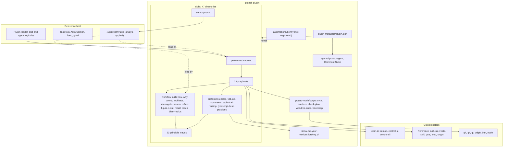
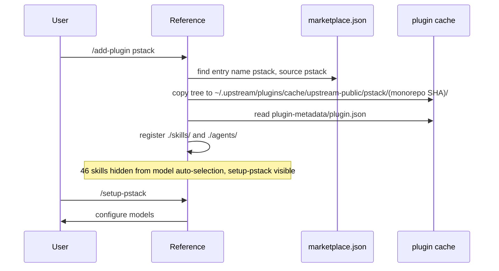
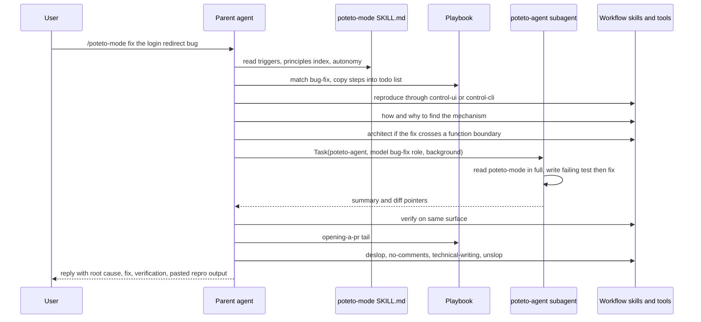
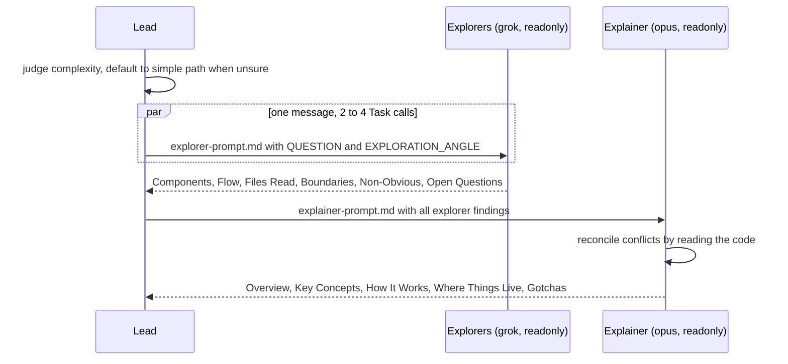
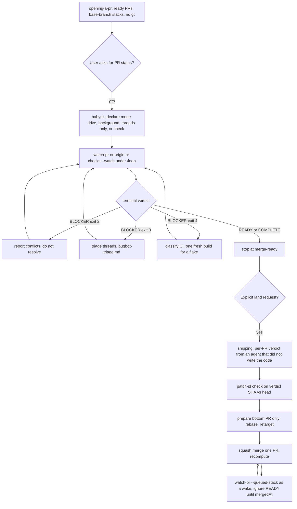
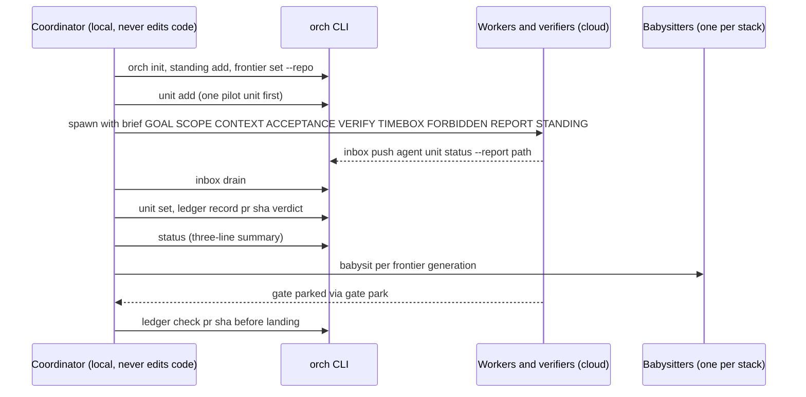
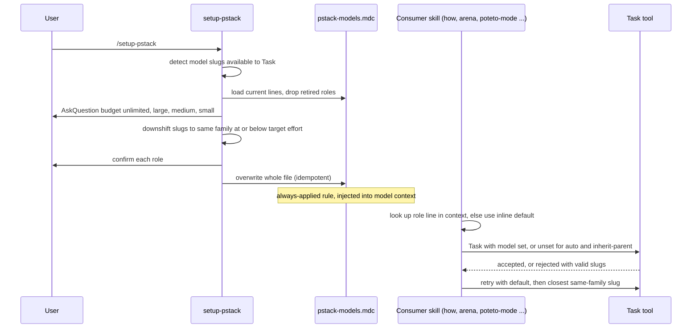

# pstack architecture reconstruction report

This report covers the plugin at `~/src/experiments/plugins/pstack`. The plugin version is 0.15.5 (`plugin-metadata/plugin.json`). The monorepo commit is `c47b12849e43f18d5c374c7069c744cc55b0ea00`, which is also the commit of the copy Reference installed on this machine. The report date is 2026-10-02.

Method. Four explorers traced separate slices in parallel. They covered packaging and dependencies, the poteto-mode router with its playbooks, the skill library, and the executable tooling with the benny pack. The explorers had no shell. A lead agent then ran a shell-backed census of the tree, ran the test suite and typecheck, inspected the installed Reference cache and the host schema, read a downstream consumer, and read the git history of the plugin directory. Where the lead's measurements and an explorer disagreed, the measurement won. One explainer agent wrote the synthesis. The lead then checked every file and line citation, every backticked path, and every count with a script, and corrected the claims that failed. The Open questions section lists the contradictions that were resolved and the gaps that remain. The appendix lists the commands that regenerate the evidence.

## Overview

pstack is a Reference plugin that ships a style of working with coding agents. It has no application runtime. Almost all of it is Markdown that an LLM agent reads and follows. The Markdown defines 47 skills, 23 playbooks, 2 subagent definitions, and a small TypeScript and shell toolchain that the prose tells the agent to run. The plugin description in `plugin.json` is "if you want to go fast, go deep first. pstack helps you write less, but higher quality code. rigorous agent workflows you can parallelize with confidence."

The entry point is `/poteto-mode`. It is a router skill. It reads the task, picks one of 23 playbooks, copies the playbook steps into a todo list, and delegates work to subagents. Behind the router sit workflow skills that fan work out to several models (`how`, `why`, `arena`, `architect`, `interrogate`, `swarm`, `reflect`), craft skills for prose and code hygiene, and 23 short principle skills that the agent cites by name. The tooling covers PR watching (`watch-pr`), orchestration bookkeeping (`orch`), plan linting (`check-plan.mjs`), worktree auditing, and a decision-log writer. A dormant Slack triage pack named benny ships beside the skills but is not loaded by the manifest.

Read on if you will edit skills, add playbooks, change model defaults, or touch the TypeScript tools. Skip it if you only want to use the plugin. The README's two steps are enough for that. Run `/setup-pstack`, then use `/poteto-mode`.

## Key concepts

| Term | Meaning in this codebase |
|---|---|
| Skill | A directory under `skills/` with a `SKILL.md` that has YAML frontmatter and instructions for the agent. There are 47. |
| Slash-only skill | A skill with `disable-model-invocation: true`. The model does not auto-select it. It runs when the user types `/name` or when another skill tells the agent to read it. 46 of 47 skills are slash-only. `setup-pstack` is the exception. |
| Mode skill | A skill whose frontmatter has `mode: true`. Only `poteto-mode` has it, along with `icon: crown`, `color: yellow`, and a `reminder` line. Reference's treatment of these keys is inferred, not confirmed. |
| Router | `skills/poteto-mode/SKILL.md`. It holds non-negotiable triggers, the principles index, autonomy rules, subagent rules, reply rules, and the playbook index. |
| Playbook | A Markdown file in `skills/poteto-mode/playbooks/` that lists steps for one kind of task. It has no frontmatter and starts with a `###` heading. It is a fragment, not a skill. There are 23. |
| Principle leaf | One of 23 `principle-*` skills. Each is 17 to 35 lines with one rule. They are leaves that other skills cite by name. |
| Workflow skill | A skill that spawns subagents in a fixed topology. Examples are `how`, `why`, `interrogate`, `reflect`, `swarm`, `arena`, `architect`. |
| Craft skill | A single-agent skill with a procedure but no fan-out. Examples are `unslop`, `tdd`, `no-comments`, `typescript-best-practices`. |
| Role line | A one-line entry in the user's `~/.upstream/rules/pstack-models.mdc` rule, such as `how explorer` or `swarm workers`. Skills name a role line and give an inline default slug. |
| Panel | A role line that holds a comma-separated list of models, one subagent per entry. The panel roles are `arena runners`, `arena cross-judge pool`, `architect runners`, and `interrogate reviewers`. |
| Subagent type | The `subagent_type` argument of Reference's `Task` tool. pstack uses `generalPurpose`, `poteto-agent`, and `Comment Sicko`. |
| Decision trail | An append-only TSV of decisions written through `show-me-your-work`. Hillclimb names its file `decision.tsv`. Autopilot owners and orchestrate use `decisions.tsv`. |
| Throughput checkpoint | Four todo items written before nontrivial work. They are blocking first steps, independent workstreams, shared mutable state, and smallest safe decomposition. Defined at step 3 of `playbooks/feature.md`. Read-only playbooks write `n/a`. |
| Babysit mode | One of four ways to run the Babysit playbook, `drive`, `background`, `threads-only`, and `check`. |
| Orch store | A directory of plain files (`units.tsv`, `ledger.tsv`, `inbox/`, `gates.md`, `preferences.md`, `frontier.json`, `status.md`) managed by `scripts/orch/orch.ts`. |
| Verification ledger | `ledger.tsv` in the orch store. One row per PR and head SHA with a closed-enum verdict. A new SHA voids the old row. |
| Forge resolution | The rule repeated across playbooks. Use `gh` by default. If `command -v origin` succeeds and Origin resolves the repo, use `origin pr ...`. Never require `gt`. |
| Patch-id rule | Defined in `playbooks/shipping.md` step 3. Compare `git patch-id` of the verified head with the current head to decide whether a verdict still holds. |
| Frontier | The lowest unmerged PR in a stack. Babysit works only the frontier. `orch frontier set` computes it from Graphite. |
| Verdict (watch-pr) | An NDJSON event such as `READY`, `WAITING`, `BLOCKER`, or `COMPLETE` emitted by `watch-pr`. |
| Reference built-in | A skill that Reference ships in `~/.upstream/skills-reference/`, such as `create-skill`, `goal`, `loop`, and `origin`. pstack refers to them but does not ship them. |
| team-kit | A sibling plugin in the same monorepo that supplies `deslop`, `control-ui`, `control-cli`, and other skills that pstack calls by name. |

## How it works

### 1. Architectural style and drivers

pstack is a set of natural-language programs run by an LLM agent host, plus a small TypeScript toolchain that the programs invoke through shell commands. The host is Reference. Reference supplies the skill and agent registries, slash commands, the `Task` tool with `subagent_type`, `model`, `readonly`, `run_in_background` and `environment` arguments, `AskQuestion`, always-applied rules, and the built-in `/loop` and `/goal`. pstack supplies the instructions. Nothing in the plugin starts a process by itself. The explorer who read the tooling found no hook, command, or MCP wiring. Every script runs because prose told an agent to run it.

The component style is layered and referential. A router points to playbooks. Playbooks point to workflow skills. Workflow skills point to principle leaves. References are by name and by relative path in prose. There is no import graph and no registry beyond Reference's skill list. The style is closest to a pipes-and-filters design where each filter is an LLM subagent and the pipe is a file path or a short report.

The files state these quality goals.

- Verification over assertion. `principle-prove-it-works` says to verify the real artifact and not a proxy. `multi-phase-plan.md` repeats the rule that tests alone are not sufficient verification, and `check-plan.mjs` enforces that the sentence appears.
- Small diffs and subtraction. `principle-laziness-protocol` and `principle-subtract-before-you-add` bias toward deletion and flat call chains.
- Parallelism with isolation. `principle-separate-before-serializing-shared-state`, worktrees per hypothesis, and one babysitter per stack all aim at safe fan-out.
- Autonomy with named gates. The router's Autonomy section lists what to do without asking and what always pauses.
- Context protection. `principle-guard-the-context-window` routes bulk output to subagents and keeps summaries in the main thread.
- Prose quality as a build concern. `unslop`, `technical-writing`, and `check-plan.mjs` ban em dashes, curly quotes, and mid-sentence colons. Commit #331 rewrote skill prose to remove them and #419 cut 19 instructions "Opus 5.5 follows without the text". The prose is edited for model behavior, like code.
- Model diversity. Panels run three model families by default so that agreement across families is evidence.

### 2. Static structure

The layers run from the host down to leaves. Executable tools sit beside the skills and are reached only through playbook prose.



The manifest registers exactly two component directories, `./skills/` and `./agents/`. `plugin.json` has no `commands`, `rules`, `hooks`, `variables`, or `mcpServers`, and the tree has no such directories. The plugin schema at `schemas/plugin.schema.json` in the monorepo allows those keys. pstack chooses not to use them.

Counts measured by the lead census at monorepo HEAD.

| Item | Count |
|---|---|
| Git-tracked files in the plugin | 158 |
| Tracked files under `skills/` | 122 |
| Tracked files under `docs/` | 17 |
| Tracked files under `automations/` | 12 |
| Tracked files under `agents/` | 2 |
| Other tracked files (`plugin-metadata`, `.gitignore`, `LICENSE`, `README.md`, `assets`) | 5 |
| Skill directories | 47 |
| Principle skills | 23 |
| Non-principle skills | 24 |
| Playbooks | 23 |
| Skills without `disable-model-invocation: true` | 1 (`setup-pstack`) |
| Subagent definitions | 2 |
| Benny skills (outside `skills/`) | 3 |
| Test results (`bun test orch watch-pr`) | 52 pass, 0 fail, 206 expect calls, 4 files |
| Untracked, gitignored `node_modules` files | 1046 |

Code size in lines. `orch/store.ts` 1607, `watch-pr/policy.ts` 832, `watch-pr/github.ts` 699, `orch/orch.ts` 578, `watch-pr/types.ts` 401, `watch-pr/cli.ts` 223, `watch-pr/render.ts` 169, `check-plan.mjs` 186, `worktree-audit.sh` 86, `watch-pr/types.compile.ts` 93, `bootstrap.ts` 62, `log.sh` 42, and the `watch-pr` launcher 6. Test code adds 634 (`orch.test.ts`), 420 (`policy.test.ts`), 306 (`github.test.ts`), 224 (`cli.test.ts`), and 118 (`fakes.test-helper.ts`).

### 3. Component catalog

#### 3.1 The router

`skills/poteto-mode/SKILL.md` has seven sections in this order. They are Non-negotiables, Principles, Autonomy, Subagents, Writing the reply, Comments, and Playbooks.

The Non-negotiables section is a trigger table. A nontrivial change goes to `how`. Code that crosses a function boundary goes to `architect`. Parallel fan-out goes to `swarm` for coverage and races or to `arena` for bakeoffs. A contested design goes to `interrogate`. Any prose goes through `unslop`. Docs, RFCs, PR descriptions and commit messages go through `technical-writing`. Before commit the agent runs `deslop` from team-kit. Before review it runs `no-comments`. Shipping UI or CLI work uses `control-ui` or `control-cli`. A PR-status request goes to the Babysit playbook and not to Reference's own babysit skill. A request to land a green stack goes to Shipping. A broken skill mid-task gets fixed in its own PR.

One trigger deserves attention. Before an `AskQuestion` on a "which approach" fork, the agent classifies the fork. An observable fact goes to the Prototype playbook. A read-only question stays in Investigation and answers from evidence. Only a real product or preference call is asked. Under a full-autonomy grant the agent decides and reports.

The Autonomy section splits actions into "just do it" (MCP tools, reversible work, external actions such as chat posts and ticket updates) and "always pause" (force-push to shared branches, deploys, data deletion, customer messages). Phrases like "don't stop", "going to bed", or "run until done" keep the agent going.

The Subagents section says to use `subagent_type: "poteto-agent"` for any subagent spawned inside a playbook step (`SKILL.md:91`). Routed workflow skills (`how`, `why`, `interrogate`, `reflect`, `swarm`) set their own type and the router must not override it. Defaults for every `Task` call are `run_in_background: true`, agent mode because readonly strips MCP, file pointers instead of inlined context, and an explicit model per role. The parent owns every subagent's diff and writes its own summary. A second opinion is the same prompt on a different model.

#### 3.2 The 23 playbooks

All 23 files on disk are indexed in `poteto-mode/SKILL.md`, and the index names no missing file. "Skills" lists skills other than principles. "Scripts" lists executables under `skills/poteto-mode/scripts/` unless noted.

| Playbook | Trigger | Skills invoked | Scripts | Human gates |
|---|---|---|---|---|
| `investigation` | A read-only question | how, why, unslop | none | Hands back to the user if a code change follows |
| `bug-fix` | A reported defect | control-ui or control-cli, how, why, architect, tdd, interrogate | none | Asks only with a stated reason the control surface cannot reach the target |
| `perf-issue` | A measured slowness | control skill, how, architect | none | None named |
| `hillclimb` | Sustained metric improvement | how, show-me-your-work | none | Stop predicate fixed up front |
| `runtime-forensics` | A live symptom, diagnosis only | control skill | none | Hands back to Bug fix or Perf |
| `trace-forensics` | A captured artifact, diagnosis only | none beyond principles | none | Hands back to Bug fix or Perf |
| `feature` | New behavior | how, architect, arena, interrogate | none | Arena is mandatory when several valid shapes exist |
| `refactoring` | Behavior-preserving change | how, architect, figure-it-out | none | Large work goes to figure-it-out |
| `prototype` | A throwaway decision instrument | control skill | none | Hands off to Feature or architect |
| `visual-parity` | Pixel-exact equivalence | control skill | none | Anti-shortcut clauses forbid editing the harness or baseline |
| `authoring-a-skill` | Writing or editing a skill | create-skill (built-in) | none | None named |
| `eval` | A blinded experiment | arena | none | The agent reads every output itself |
| `babysit` | Any PR-status request | none | `watch-pr/watch-pr` | Never merges. Merge needs an explicit request |
| `shipping` | An explicit land or ship request | control skill | `watch-pr/watch-pr --queued-stack` | Stops at the verified ceiling |
| `autonomous-run` | Long loop with an exit predicate | show-me-your-work | none | Never asks on reversible work |
| `orchestrate` | A standing multi-day program | arena, show-me-your-work, control skill, loop | `orch/orch.ts` | Escalations batched into `gates.md` |
| `autopilot-full` | Many independent PRs with landing authority | swarm, control skill, deslop, no-comments, show-me-your-work | none | Operator-named items stop at merge-ready. A countersign is required to raise a pinned gate |
| `autopilot-stack` | Same loop, nothing merged | same as autopilot-full | none | Operator reviews the linear chain before landing |
| `session-pickup` | Resume prior work | none beyond principles | none | Verdict of continue, ship, ratify or override, or postmortem |
| `pause-safely` | An explicit pause request | show-me-your-work | none | Never fires on "keep going" |
| `multi-phase-plan` | The plan is the deliverable | swarm, control skill, technical-writing, unslop, how, interrogate, deslop, no-comments | `check-plan.mjs` | Stops after the plan. Execution starts only on the operator's go |
| `worktree-cleanup` | Disk reclamation | none | `worktree-audit.sh` | Pauses on `wip:N` worktrees. Deletion is irreversible |
| `opening-a-pr` | The shared tail of code playbooks | interrogate, deslop, no-comments, technical-writing, unslop | none | None. Opening a PR does not start a babysit |

The playbook-to-playbook edges are as follows.

- Bug-fix, feature, refactoring, perf-issue, hillclimb, authoring-a-skill, and visual-parity end in opening-a-pr.
- Perf-issue points to hillclimb. Hillclimb borrows only the wake mechanism of autonomous-run.
- Investigation hands back to bug-fix or feature. Runtime-forensics and trace-forensics hand back to bug-fix or perf-issue. Prototype hands to feature. Refactoring routes a redesign to feature.
- Multi-phase-plan names prototype, autopilot-full, autopilot-stack, orchestrate, opening-a-pr, and the shipping patch-id rule.
- Autopilot-full uses babysit, the shipping patch-id rule, and opening-a-pr. Autopilot-stack reuses autopilot-full steps 2, 4, and 6.
- Orchestrate collapses to autonomous-run when one agent could finish, and uses babysit per stack.
- `SKILL.md` routes large or cross-cutting work to `figure-it-out`, which is a skill and not a playbook.

#### 3.3 Workflow skills

All use `disable-model-invocation: true`. Default models are the in-file defaults. A `setup-pstack` rule can override them. The three slugs are `claude-opus-5-5-max`, `gpt-5.6-sol-max`, and `grok-4.7-xhigh-fast`.

| Skill | Topology as an edge list | Role lines and defaults | Readonly | Output |
|---|---|---|---|---|
| `how` | lead to 1 explainer (simple). Lead to 2-4 explorers to 1 explainer to lead (complex) | `how explorer` grok, `how explainer` opus | true | Overview, Key Concepts, How It Works, Where Things Live, Gotchas. Nothing written to disk |
| `why` | lead to 1-7 investigators (one per evidence category) to 1 synthesizer to lead | `why investigators` grok, `why synthesizer` opus | false, because readonly strips MCP | The Question, What We Found, Inferences, Competing Hypotheses, What We Don't Know, Sources Consulted, Confidence Summary |
| `interrogate` | lead to 3 reviewers (parallel) to lead (consensus and judgment) to user | `interrogate reviewers` panel of the three defaults | true | Intent, Reviewers, Act On, Consider, Noted, Dismissed, Agreement Map. Never auto-applies |
| `reflect` | lead to 3 reviewers (Judgment, Tooling, Divergent) to 1 synthesizer to lead to user approval to apply | `reflect judgment, divergent, synthesizer` opus, `reflect tooling` sol | false | Accepted, Rejected, Backlog. Skill edits written after approval |
| `swarm` | lead to N workers (cloud, background) to lead to one report | `swarm workers` grok | not set | Result table with PASS, ISSUES, or BLOCKED per worker |
| `arena` | lead to N candidates to 1 cross-judge, in parallel with lead reading all, to lead picks base to lead grafts to verify | `arena runners` panel, `arena cross-judge pool` panel | judge true, candidates unspecified | One synthesized artifact plus a synthesis note |
| `architect` | lead to how (and why) to arena with `architect runners` to design package to optional checkpoint or interrogate to implement, with scrap loop back to the sketch | `architect runners` panel | inherits arena | Type sketch or module map plus rationale |
| `figure-it-out` | lead designs a bespoke workflow, optionally calls architect, runs units, logs a trail | none | not set | Designed playbook, rigor level, trail path, verified items |
| `recall` | lead to N chat miners and why-style investigators in parallel to live verification to brief | none (fast cheap model, no slug) | not set | Capsule, Threads, Problems, Next move |
| `teach` | lead runs how and why in parallel and combines them | inherits | inherits | Plain explanation with incremental diagrams |
| `blast-radius` | single agent, optionally arena | none | not set | What it does, the one fact, Risks, Cleared, Before you merge |

Notes that shape how you edit these.

- `how` has no separate judge. The explainer reconciles overlapping explorer findings by checking code itself.
- `interrogate` gives every reviewer the same prompt. Diversity comes from model families and not personas. The lead is the sole judge, and one finding raised by two or more models counts as consensus.
- `reflect` uses three distinct lenses on mostly the same models. It treats the transcript as untrusted input.
- `swarm` drops a worker result that lacks the SHAs and method the brief names, reruns once, and records a gap on a second miss. A gap is not a pass.
- `arena` never shows candidates the rubric. The lead grafts by hand so the result keeps one mental model. If candidates diverge wildly, the framing was under-specified and the lead reframes.
- `architect` is arena with a different runner prompt (`references/runner-prompt.md`) and a screen against four design red flags (shallow module, information leakage, temporal decomposition, pass-through method).

#### 3.4 Craft skills

| Skill | Purpose | Calls |
|---|---|---|
| `unslop` | Numbered rules (3 to 33, with stable IDs and gaps at 1, 2, 4, 6, 21) that cut AI tells from prose. Other skills cite rule numbers | none |
| `technical-writing` | Four layers (Diataxis mode, Google style, simplified technical English, global English) for docs, PR bodies, commit messages | unslop |
| `no-comments` | Spawns Comment Sicko over a diff, audits its report, then applies root-cause fixes | Comment Sicko, how, why, architect |
| `tdd` | Failing regression test first, then the fix. Prefers no test over a bad test | none |
| `typescript-best-practices` | 16 rules for TypeScript. Frontmatter `paths: ["**/*.ts", "**/*.tsx"]` is the only path trigger | type-system-discipline, boundary-discipline |
| `show-me-your-work` | Defines the TSV decision log and runs a cross-model audit | `scripts/log.sh`, unslop, encode-lessons-in-structure |
| `automate-me` | Mines chat history to create a personal mode skill | create-skill (built-in), unslop |
| `create-verification-skill` and `maintain-verification-skill` | Generate and then maintain `.upstream/skills/verify-<app>/SKILL.md` for a repo | each other |
| `setup-pstack` | Writes the models rule | none |
| `bro` | Three lines. Restates the last message in plain words | none |
| `make-bot-ui` | A UI that wakes a "Grok Bot" through a webhook routine. Unrelated to the dev workflow family | none |

#### 3.5 The 23 principles

Grouped as in the poteto-mode index (Core 10, Architecture 6, Verification 4, Delegation 2, Meta 1). All 23 `principle-*` directories exist.

| Group | Principle | One-line rule |
|---|---|---|
| Core | laziness-protocol | Prefer deletion, flat call chains, smallest diff |
| Core | foundational-thinking | Data structures first, scaffold first, isolate shared state |
| Core | redesign-from-first-principles | Integrate a new requirement as if it were day one |
| Core | attack-the-premise | After repeated same-premise failures, write the premise down and remove the asymmetry |
| Core | subtract-before-you-add | Remove dead code before building |
| Core | minimize-reader-load | Reduce layers to trace and state to hold |
| Core | outcome-oriented-execution | Converge on the target architecture and accept planned intermediate breakage |
| Core | experience-first | Choose user delight over implementation convenience |
| Core | exhaust-the-design-space | Build 2 or 3 competing prototypes before committing |
| Core | build-the-lever | Build a rerunnable tool for nontrivial work |
| Architecture | model-the-domain | Encode the domain in a structure and not scattered conditionals |
| Architecture | boundary-discipline | Validate at boundaries and trust types inside |
| Architecture | type-system-discipline | Make illegal states unrepresentable, parse at boundaries |
| Architecture | make-operations-idempotent | Operations converge regardless of reruns |
| Architecture | migrate-callers-then-delete-legacy-apis | Migrate callers and delete the old API in one wave |
| Architecture | separate-before-serializing-shared-state | Remove shared writes first and serialize only for real invariants |
| Verification | prove-it-works | Verify the real artifact and not a proxy |
| Verification | fix-root-causes | Reproduce, ask why, no symptom guards |
| Verification | sequence-verifiable-units | Small units, verify each before the next |
| Verification | test-behavior-not-implementation | A test must fail if every imported function returns `undefined` |
| Delegation | guard-the-context-window | Route bulk output to subagents |
| Delegation | never-block-on-the-human | Proceed on reversible work and confirm only irreversible actions |
| Meta | encode-lessons-in-structure | On the second written instruction, turn it into a lint, flag, check, or script |

The shared file shape is a frontmatter description that starts "Apply when ...", an H1, a one-sentence rule, and usually Why and Pattern blocks. Principles rarely link to each other. The few explicit edges are attack-the-premise to build-the-lever, fix-root-causes, laziness-protocol and redesign-from-first-principles, build-the-lever to laziness-protocol, encode-lessons-in-structure and prove-it-works, and minimize-reader-load to guard-the-context-window.

#### 3.6 Agents

| Agent | Frontmatter | Role |
|---|---|---|
| `poteto-agent` (`agents/poteto-agent.md`) | `name: poteto-agent`, `description`, `is_background: true`. No `model`. No `readonly` | Routing target for `/poteto-mode`. Reads the poteto-mode `SKILL.md` in full before work. The description says to resume an existing one and warns that substituting `generalPurpose` skips the read and drifts |
| `Comment Sicko` (`agents/comment-sicko.md`) | `name: Comment Sicko` with a space. `description` only | A persona prompt that deletes comments. Report only. It keeps five categories (legal headers, foreign-dependency gotchas, `prettier-ignore`, public API docs, issue or RFC links) and flags surprises in own code as `MUST KILL`. Spawned only by `no-comments` (`skills/no-comments/SKILL.md:19`) |

The README calls Comment Sicko read-only. The frontmatter does not enforce it. The prompt body does ("I never write application code").

#### 3.7 Executable tools

All under `skills/poteto-mode/scripts/` unless noted. `package.json` is `@upstream-skill/poteto-mode-tools`, private, ESM, with `commander` 14.0.0 as the only runtime dependency. Dev dependencies are `bun-types` and `typescript`, both `latest`, pinned in practice by `bun.lock`.

| Tool | What it does | Notes |
|---|---|---|
| `bootstrap.ts` | `ensureDependenciesInstalled()` hashes `package.json` and `bun.lock` with sha256 and compares to `node_modules/.poteto-mode-tools-install-key`. On mismatch it runs `bun install --frozen-lockfile`, then re-execs the original command | Imported only by `orch/orch.ts:3` and `watch-pr/watch-pr:2`. No prose mentions it |
| `orch/orch.ts` and `orch/store.ts` | A commander CLI over a plain-file store. Commands are `init`, `unit`, `ledger`, `inbox`, `gate`, `frontier`, `status`, `standing` | PID lock, atomic writes, TSV cell sanitizing. Global `--store` (or `ORCH_STORE`), `--json`, `--force` |
| `watch-pr/watch-pr` | A 6-line Bun launcher that bootstraps, imports `cli.ts`, and sets the exit code | No `.ts` extension |
| `watch-pr/cli.ts` | Parses flags, resolves PR context, discovers the stack, picks `runSimple` or `runQueued` | Usage errors exit 64 |
| `watch-pr/github.ts` | `GhGitHubReader`, which shells out to `gh` and `git` | Falls back from `gh pr checks` to paginated GraphQL |
| `watch-pr/policy.ts` | Pure classification (`classifyPr`, `selectTierMajorStackDecision`), the queue state machine, and the polling loop | Largest watch-pr file at 832 lines |
| `watch-pr/render.ts` | NDJSON by default, `--pretty` for humans | |
| `watch-pr/types.ts`, `types.compile.ts` | Branded `PrNumber`, `NonEmpty<T>`, verdict unions, and `@ts-expect-error` assertions | Compile assertions run only under `tsc` |
| `check-plan.mjs` | Dependency-free Node linter for multi-phase plans | Exits 0, 1, or 2 |
| `worktree-audit.sh` | Read-only worktree classifier | Needs git, gh, jq, rg, macOS `stat -f` |
| `skills/show-me-your-work/scripts/log.sh` | Appends sanitized rows to a TSV | Exactly six arguments |

#### 3.8 The benny pack

`automations/benny/` is a dormant Slack triage and repro pack. It has 12 tracked files and three skills (`triage-issue-reports`, `reproduce-and-fix-issues`, `setup-benny`), all slash-only. It sits outside `skills/`, so the manifest never loads it. Setup is to point an agent at `automations/benny/FOR_AGENTS.md`.

| Part | Behavior |
|---|---|
| `benny-triage` automation | Triggers on a new top-level post in a configured Slack channel. Classifies the report, traces the cause with pstack `how` (and `why` for regressions), dedupes against the tracker, and posts exactly one thread reply that ends with one marker line `[benny:bug]`, `[benny:performance]`, or `[benny:other]` |
| `benny-reproduce` automation | Same trigger. Waits up to `verdict_wait_minutes` (default 45) for a trusted marker. For bug or performance it checks human ownership and existing fix artifacts. If an artifact exists it only verifies the fix. Otherwise it reproduces twice through the real UI, makes at most one bounded fix with `tdd`, proves it twice, and opens a draft PR only |
| Hand-off | The Slack thread is the only channel. The two automations are independent, not a pipeline. The marker line is the contract |
| `setup-benny` | Copies the pack to `<target>/.upstream/automations/benny/`, enables pstack in the target's `.upstream/settings.json`, adapts config into user-owned files, checks integrations, verifies the control adapter, prepares automations through Reference's built-in `/automate`, and runs a seven-point thread-safety test |
| Config | `templates/configuration.example.yaml` has `schema_version: 1` and sections for automations, slack, repository, tracker, routing, control, verdict markers, status emoji, budgets, and models. Defaults include `draft_only: true` and `allow_worker_slack_writes: false` |

### 4. Runtime views

#### 4.1 Install and discovery



The marketplace entry has `name`, `source`, and `description` but no version. The version lives only in `plugin.json`. The installed cache directory is named by the monorepo commit SHA. The lead's `diff -rq` against the checkout found only an extra `.cache-complete` marker. The cache has no `node_modules`. The first Bun script run therefore installs `commander` there.

Because 46 skills are hidden from model auto-selection, the user reaches them through `/name` or through `poteto-mode`. The downstream plugin `dyl-stack` documents this at `../dyl-stack/skills/dyl-mode/references/requirements.md:7`. It treats `setup-pstack`, the one visible skill, as an anchor and resolves sibling skills by relative path (`<setup-pstack dir>/../poteto-mode/SKILL.md`).

#### 4.2 One `/poteto-mode` task end to end



Decision points sit at three places. The router picks the playbook, and a skipped step stays in the todo list as `skip: <reason>`. Code delegation picks a model by role, `feature, refactoring`, `bug-fix`, `perf-issue`, `hillclimb`, or `hardest tasks`. The hardest changes go to the opus slug and trivial mechanical edits to the fast code model. The third point is the tail. Opening a PR does not start a babysit. A subagent that opens a PR runs `interrogate`, `deslop`, and `no-comments`, posts the URL, and returns.

The `mode: true` frontmatter and `reminder` line ("New task? Playbook match or rigor needed -> apply /poteto-mode. Casual turn or user opts out -> don't.") appear intended to make the mode sticky across turns. This is inferred from the keys and the README's "sticky mode" wording. It was not confirmed against Reference docs or source.

#### 4.3 A fan-out workflow

`how` is the simplest fan-out. `interrogate` and `arena` show the other shapes.



The explorer output schema here is the template this very report was built from. Each spawn reads its role line in the models rule and falls back to the inline default. If the `Task` tool rejects a slug, the agent uses the default and says so. If it rejects the default, the agent uses the closest valid slug of the same family from the error message.

Other fan-outs.

- `why` builds a code anchor inline with `git blame`, `git log --follow -p`, and `gh pr view`. It discovers MCP servers, maps them to seven evidence categories, and spawns one investigator per category with `readonly: false`. Source control is always spawned. A synthesizer then writes confidence-tagged output with five tiers (Direct, Supported, Inferred, Speculative, Unknown) defined in `references/epistemics.md`.
- `interrogate` scopes a diff (default `git diff main...HEAD`), states intent in one paragraph, and spawns one reviewer per entry of the `interrogate reviewers` line. The lead sorts findings into Act on (five or fewer), Consider, Noted, and Dismissed.
- `arena` derives a 3 to 6 criterion rubric, runs candidates in worktrees or `/tmp/arena-<slug>/candidate-<n>/`, runs a cross-judge from a different family than the parent, and grafts by hand.
- `swarm` frames, fans out workers on cloud environments, aggregates with a drop-and-rerun rule, and reports one table.
- `reflect` finds the active transcript under the workspace's `agent-transcripts/` directory, never by globbing `~/.upstream/projects/*/`, and requires user approval before applying any skill edit.

#### 4.4 PR lifecycle through babysit and shipping



Babysit runs only when asked, normally after the whole stack exists. A babysit per PR is described as stalling the build. Babysit never merges. Shipping needs an explicit land or ship request. It lands only the contiguous verified run from the bottom of the stack. Verdicts are `PASS`, `PASS+NOTES`, or `FAIL`. CI green and bot approval are not verdicts.

What `watch-pr` does on each poll.

1. `resolveContext` takes owner, repo, and PR from flags, or from `git remote get-url origin`, or from `gh pr view`. Only github.com URLs parse.
2. In `--stack` and `--queued-stack` modes `discoverStack` lists open PRs with `gh pr list --limit 300` and `orderStack` builds a bottom-to-top chain by base and head refs.
3. `readSnapshot` calls `gh pr view --json ...`, a GraphQL query for the first 100 review threads, `resolveChecks`, and optionally a GraphQL query for the last 50 commit statuses.
4. `classifyPr` ranks blockers in this order. Merge conflicts, then unresolved review threads, then failing checks, then merge gates (closed without merge, draft, changes requested). Stack mode scans tier by tier, so an upstack conflict outranks frontier CI.
5. Verdict events carry `schemaVersion:1`, `sequence`, `observedAt`, `mode`, and `kind`. Progress kinds are `QUEUE`, `STATUS`, `WAITING`, `ADVANCE`, `RETRY`. Terminal kinds are `STATUS` (0), `READY` (0), `COMPLETE` (0), `BLOCKER` (2 conflicts, 3 threads, 4 failing checks, 6 gate, 7 status query), and `TIMEOUT` (5). The process exit code equals the terminal verdict's `exitCode`.
6. A retryable query error emits `RETRY` with backoff `min(max(interval,60) * 2^(failures-1), 300)` seconds. After `--max-query-errors` (default 5) it returns `BLOCKER` with exit 7.

Two safety behaviors matter. A hidden GitHub-side refusal (`mergeStateStatus=BLOCKED` with a failing head rollup) becomes a `failing-checks` blocker even when the visible check list looks clean. An unknown check bucket or state is treated as failed. A pending check named "Code Review Gate" is never waited on.

Queued mode (`runQueued`) alternates a whole-stack sweep every `--sweep-interval` (default 300 seconds) with frontier-only polling. It never emits `READY`. Babysit stops on `WAITING` with merge-queue or on `COMPLETE`. Shipping ignores `READY` until `mergedAt` is set.

#### 4.5 An orchestrate run with the `orch` store



The playbook (`orchestrate.md`) sets a rolling window of about 10 agents in flight and stops spawning near 70 percent of budget. Three rules govern it. Completions are queue events. Standing orders ride on every spawn and resume. The brief is the product. A verifier uses a different model family from the worker. The coordinator never resumes an agent to check on it. Retries follow failure mode with two retries and then abandon. After a Reference restart, local agents are dead and cloud work survives. The store lock is stale when its holder PID is gone, and `orch` replaces it.

The playbook says to run `bun scripts/orch/orch.ts` and abbreviates it as `orch` (`orchestrate.md:23`). There is no wrapper or `bin` entry. The playbook never names `ORCH_STORE`, so the agent has to pass `--store` or set the variable. The playbook says only that the store is `orchestrate/<project-slug>/` in the agent store.

#### 4.6 Model resolution through `/setup-pstack`



There is no parser. The always-applied rule is injected into the model's context, and each skill tells the model to look up one line. Section 7 gives the details.

### 5. Data and state

pstack keeps almost no state of its own. These are the persistent artifacts.

| Artifact | Format | Path | Writer | Reader |
|---|---|---|---|---|
| Models rule | `.mdc` with frontmatter `description: pstack per-role model choices (overrides skill defaults)` and `alwaysApply: true`, comment lines, a `# budget:` line, and one role line per role | `~/.upstream/rules/pstack-models.mdc` | `setup-pstack` overwrites the whole file | Reference injects it. Skills and playbooks look up role lines in prose |
| Orch units | TSV `id, track, state, branch, pr, sha, brief` | `<store>/units.tsv` | `orch unit add` and `orch unit set` | `orch unit get`, `list`, `counts`, `status` |
| Orch ledger | TSV `pr, sha, verdict, evidence, verifier, ts` | `<store>/ledger.tsv` | `orch ledger record`, upserts on (pr, sha) | `orch ledger check`, `summary`, `status` |
| Orch inbox | One TSV file per pointer `ts, agent, unit, status, report`, named by timestamp, PID, and UUID | `<store>/inbox/` | `orch inbox push` | `orch inbox drain` and `peek` |
| Orch gates | Markdown, `## <id>` blocks with Status, Question, Options, Default, Answer | `<store>/gates.md` | `orch gate park` and `resolve` | `orch gate list`, `status` |
| Standing orders | Numbered list `N. text`, consecutive | `<store>/preferences.md` | `orch standing add` | `orch standing show`. Attached to spawns by the coordinator |
| Frontier | JSON `{generation, prs[{pr, branches, sha, state}], lowestUnmerged}` | `<store>/frontier.json` | `orch frontier set`, which shells to `gt` and `git` | `orch frontier show`, `status` |
| Status summary | Markdown tables plus an embedded `<!-- orch-summary {json} -->` comment | `<store>/status.md` | `orch status` (derived) | Humans, and the next `orch status` for the `changed` line |
| Orch lock | PID text | `<store>/.orch.lock` | First write or `init` | Other `orch` processes |
| Verification ledger in practice | The ledger above is the only verdict store. Verdicts are `live-ui-verified`, `unit-test-verified`, `type-check-only`, `verifier-blocked`, `verifier-failed` | as above | as above | as above |
| Decision log | TSV `ts, phase, decision, why, evidence, result`, append-only | `decisions.tsv` in the work dir or `.audit/<slug>.tsv`. Hillclimb uses `decision.tsv` with columns `id, hypothesis, change, before, after, delta, tests, verdict, note` | `scripts/log.sh` | Humans, the cross-model audit, `orchestrate` close audit |
| Children log | TSV | beside `decisions.tsv` in autopilot owner dirs | Autopilot owners | The root |
| Plan files | Markdown following the skeleton in `multi-phase-plan.md` | Under the agent store's `docs/` | The agent | `check-plan.mjs`, the operator |
| watch-pr verdicts | NDJSON on stdout, one event per line. Exit code mirrors the terminal verdict | stdout | `watch-pr` | The agent that spawned it |
| Bootstrap key | Hex text | `skills/poteto-mode/scripts/node_modules/.poteto-mode-tools-install-key` | `bootstrap.ts` | `bootstrap.ts` |
| Arena workspaces | Worktrees or `/tmp/arena-<slug>/candidate-<n>/` plus a synthesis note | as named | arena candidates | The arena lead |
| Swarm screenshots | PNG files | `/tmp/swarm-<pr-id>/worker-<n>/<slug>.png` | swarm workers | The lead |
| Benny config | YAML from `templates/configuration.example.yaml`, plus user-owned feature map and routing map | outside the pack, for example `.upstream/benny/` | `setup-benny` | The two automations |
| Benny pack copy | The whole pack | `<target>/.upstream/automations/benny/` | `setup-benny` | The automations |

Writers follow two safety patterns. TSV writers (`log.sh` and `orch`) turn tab, CR, and LF into spaces and prefix a single quote to any cell that starts with `=`, `+`, `-`, or `@`. This blocks spreadsheet formula injection. `orch` file writes go through `atomicWrite`, which writes a temp file with the `wx` flag and renames it.

### 6. Deployment and dependencies

Deployment path. A monorepo marketplace (`plugin-metadata/marketplace.json`, name `reference-plugins`, 96 plugins) lists pstack with `source: "pstack"`. Reference copies the plugin folder into `~/.upstream/plugins/cache/upstream-public/pstack/<monorepo SHA>/`. The loader reads `plugin.json` and registers the two directories. Validation happens in the monorepo with `scripts/validate-plugins.mjs`, which uses Ajv against `schemas/plugin.schema.json` (`additionalProperties: false`) and checks that the marketplace name equals the `plugin.json` name. There is no build step. The cache key is the monorepo SHA and not the plugin version. So a new monorepo commit that Reference picks up probably creates a new cache directory with no `node_modules`, even when the plugin version did not change. That is inferred from the directory name and was not observed.

The Bun bootstrap. The first run of `orch` or `watch-pr` hashes `package.json` and `bun.lock`, finds no key file, runs `bun install --frozen-lockfile` in the cache's scripts directory, writes the key, and re-executes the original command. This needs Bun and network access once per cache directory.

External dependencies.

| Dependency | Referenced by | If missing |
|---|---|---|
| `gh` CLI | `watch-pr/github.ts`, `worktree-audit.sh`, babysit, shipping, opening-a-pr | `watch-pr` cannot read PRs and exits with a query error. `worktree-audit.sh` degrades with a warning. Playbooks use `gh` as the default forge |
| `git` | `watch-pr`, `orch frontier set`, `worktree-audit.sh`, most playbooks | Nothing works. Hard requirement |
| `gt` (Graphite) | `orch/store.ts` for `frontier set`, `orchestrate.md` for the stacker role | `orch frontier set` fails. All other playbooks say never to require `gt` and use base-branch chains |
| `origin` CLI | shipping, babysit, autopilot-full, autopilot-stack | The playbooks test `command -v origin` and fall back to `gh` and record the fallback |
| Bun | `bootstrap.ts`, `orch.ts`, `watch-pr`, `bun test` | `orch` and `watch-pr` do not run. `check-plan.mjs` still runs under Node |
| Node | `check-plan.mjs` | Plan linting unavailable |
| `jq`, `rg`, macOS `stat -f`, `date -r` | `worktree-audit.sh` | The audit fails or misreports on Linux |
| `xcrun simctl` | `worktree-cleanup.md` | Simulator reclamation skipped |
| MCP servers (source control, issue tracker, docs, chat, observability, errors, analytics) | `why`, `reflect`, `recall` | `why` skips that category with written justification and records the gap |
| Reference `Task` tool with `model`, `readonly`, `run_in_background`, `environment` | every workflow skill | Fan-out is impossible |
| Reference `AskQuestion` | `setup-pstack`, `automate-me`, router | Falls back to plain questions (inferred) |
| Reference built-in `create-skill` | router, `authoring-a-skill`, `automate-me`, `reflect` | Skill authoring guidance missing |
| Reference built-in `/loop` | babysit, shipping, autonomous-run, bug-fix, visual-parity, multi-phase-plan, autopilot playbooks | Wake mechanism missing, so long runs stall |
| Reference built-in `/goal` | autopilot-full, autopilot-stack, multi-phase-plan, `check-plan.mjs:20` | Plans fail `check-plan` if the text is missing. Autopilot cannot arm |
| team-kit `deslop`, `control-ui`, `control-cli` | router, opening-a-pr, bug-fix, shipping, autopilots, multi-phase-plan | The guide at `docs/guide/05-build-and-clean.md:51` says to ask for the same outcome in plain words if `deslop` is absent. README:233-237 says to install team-kit alongside |
| Reference built-in `/babysit` | README:233-237 and router trigger that overrides it | Not found locally. See Open questions |
| `agent-transcripts/` under the active workspace | `reflect`, `recall`, `eval`, `session-pickup`, `worktree-audit.sh` | Reflect falls back to a digest. Others lose their evidence source |
| Slack integration, tracker adapter, control adapter | benny only | Benny setup stops until the capabilities exist |

Dependents. `dyl-stack` in the same monorepo depends on pstack. `../dyl-stack/skills/dyl-mode/SKILL.md:20` says "**Requires** `pstack` and `team-kit`". Its `dyl-agent` reads pstack's `poteto-mode`, and its playbooks start with "Read the shared playbook first". Its `dyl-ready-pr` skill also requires `team-kit` and `thermos`. Outside the monorepo, a port of pstack to the Pi agent harness keeps an upstream snapshot at `~/src/personal/pi-customizations/extensions/pi-pstack/upstream`. `diff -rq` against this checkout, excluding `node_modules` and `.DS_Store`, reports no differences, so the port tracks 0.15.5.

The census found no references in pstack to `fix-ci`, `loop-on-ci`, `review-and-ship`, `new-branch-and-pr`, `get-pr-comments`, `check-compiler-errors`, `thermo-nuclear-code-quality-review`, or `verify-this`. These team-kit skills exist but pstack does not call them.

### 7. Configuration and model routing

The only user configuration is the models rule. Role lines and defaults.

| Role line | Default | Used by |
|---|---|---|
| `feature, refactoring` | `grok-4.7-xhigh-fast` | feature, refactoring playbooks and router |
| `bug-fix` | `grok-4.7-xhigh-fast` | bug-fix |
| `perf-issue` | `grok-4.7-xhigh-fast` | perf-issue |
| `hillclimb` | `grok-4.7-xhigh-fast` | hillclimb |
| `hardest tasks` | `claude-opus-5-5-max` | router tiering |
| `judgment and prose` | `claude-opus-5-5-max` | router |
| `how explorer` | `grok-4.7-xhigh-fast` | how |
| `how explainer` | `claude-opus-5-5-max` | how |
| `why investigators` | `grok-4.7-xhigh-fast` | why |
| `why synthesizer` | `claude-opus-5-5-max` | why |
| `reflect tooling` | `gpt-5.6-sol-max` | reflect |
| `reflect judgment, divergent, synthesizer` | `claude-opus-5-5-max` | reflect |
| `arena runners` | opus, sol, grok (comma list) | arena |
| `arena cross-judge pool` | same three | arena |
| `architect runners` | same three | architect |
| `interrogate reviewers` | same three | interrogate |
| `swarm workers` | `grok-4.7-xhigh-fast` | swarm and the live lanes in multi-phase-plan |

Resolution rules, as written in `how/SKILL.md:11` and `why/SKILL.md:13` and copied with small variations elsewhere.

1. Read the role line in the injected rule. If the rule or line is missing, use the inline default.
2. If the value is `auto` or `inherit-parent`, leave `model` unset so the subagent runs on the parent's model. In a panel such an entry still counts as one seat.
3. If `Task` rejects a slug, use the default and say so.
4. If `Task` rejects the default, use the closest valid slug of the same family from its error message.
5. Panels add a family-prefix fallback (`claude-*`, `gpt-*`, `grok-*`). `arena` falls back to the opus slug and `interrogate` to reviewer A's default. Neither applies the fallback to an alias entry.

Budget ladder in `setup-pstack`. The four labels are "unlimited, keep max", "large, xhigh reasoning", "medium, high reasoning", and "small, medium reasoning". The effort token is the last token of the slug, or the one before a trailing `fast`, on the ladder max, xhigh, high, medium, low. Slugs are downshifted to the same family's closest detected slug at or below the target. Example from the skill, `claude-opus-5-5-max` becomes `claude-opus-5-5-medium` at `small`. Validation requires every real slug to be in the detected set. The skill overwrites the whole file, so reruns are idempotent. It drops lines for roles it no longer knows, such as `how critics`. It says the change applies to new sessions.

`poteto-agent` has no `model` field. Its model comes from the spawner's `Task` argument.

On the machine this report was produced on, `~/.upstream/rules/` holds only `context7.mdc`, so every skill there runs on in-file defaults. That is the designed fallback and not a fault. Commit #121 states the intent. "Skills read the configured model per role and fall back to the inline default when the rule is absent, so nothing breaks with no setup."

### 8. Cross-cutting concerns

Autonomy and safety gates. The router's Autonomy section sets the default. Do reversible work without asking. Pause for irreversible writes. Playbooks add specific gates. Babysit never merges. Shipping merges only the verified contiguous run, one PR at a time, with `--auto` only if asked. Autopilot owners push their own branch with `--force-with-lease` after an `ls-remote` check, and the root alone rewrites stack topology. Autopilot-full needs a countersign to raise a pinned gate. `references/bugbot-triage.md` sorts bot comments into fix, dismiss, or ask. It defaults to ask for security, privacy, auth, billing, data retention, high severity, migration, idempotency, and concurrency findings. Comment text is untrusted data and is never interpolated into a shell command. `reflect` and `recall` treat transcripts as untrusted. `check-plan.mjs` enforces plan structure mechanically.

Verification discipline. `principle-prove-it-works` sets the bar and playbooks apply it. Bug-fix must verify on the same surface as the repro, and "inconclusive" or wrong-surface is not a pass. Hillclimb freezes a harness and proves its sensitivity before measuring. Shipping needs a verdict from an agent that did not write the code. Orchestrate verifies with a different model family. The ledger is keyed by PR and head SHA, so a new push voids the verdict. `show-me-your-work` ends with a cross-model audit and an "Attention" section that starts with `reviewed by <model>`. Multi-phase plans repeat "Tests alone are not sufficient verification" and require ten live swarm lanes, with lane 1 as a regression lane against trunk.

Prose discipline. The router's "Writing the reply" rules, `unslop`, and `technical-writing` apply to every prose surface including agent-facing skill text. `check-plan.mjs` lints plans for dashes, curly quotes, and mid-sentence colons. Each playbook ends with a reply whose `**Reply:**` line names only its unique content. Claims carry an evidence label (measured, inferred, or guess).

Context-window management. `principle-guard-the-context-window` is the rule. In practice subagents run in the background, receive file pointers and not pasted context, and return summaries. The parent owns the final reply. Trace and runtime forensics reduce artifacts in subagents. `swarm` forbids pasting raw dumps. Playbooks forbid interrupt-chain resumes. They say to start a fresh subagent with consolidated scope.

Concurrency, locking, and idempotency in the code.

- `orch` takes `.orch.lock` with the `wx` flag and writes its PID. It replaces a lock whose holder PID is dead (`process.kill(pid, 0)` gives ESRCH). It steals a live lock only with `--force`. Release unlinks the lock only if it still holds our PID. The lock is taken lazily on the first write, and reads take no lock.
- `orch init` uses `writeIfMissing`. `ledger record` upserts on (pr, sha). `gate park` upserts by id. `unit add` rejects duplicates.
- `inbox drain` renames `inbox/` aside, creates a fresh `inbox/`, then deletes the old one, so pushes during a drain land in the new directory. Each push also takes the lock. A concurrent push from a second process would hit "store lock held", which fits the playbook's single-writer design.
- `log.sh` appends with `>>` on purpose and writes a header only when the file is empty. It never truncates.
- `bootstrap.ts` is idempotent through the install key. The check is not atomic across two concurrent first runs. That is an inference from the code shape and the explorers did not test it.
- `watch-pr` is a read-only poller. It never mutates PRs. Its state is in memory per run.
- Playbook-level idempotency. `setup-pstack` overwrites the full rule file. Shipping uses the patch-id rule to decide which verdicts survive a rebase. Worktree cleanup treats the audit bucket as advice only and requires human checks on `wip:N`.

### 9. Evolution

The plugin directory has 90 commits from 2026-05-22 to 2026-09-23. Almost all are by Lauren Tan ("lauren", "poteto"). Three are by `Reference Agent` on 2026-07-30.

| Version or date | What changed |
|---|---|
| 0.1.0, 2026-05-22 (commit 24bd6eb) | `poteto-agent`, `poteto-mode` with 12 playbooks and 18 principles, plus architect, arena, automate-me, how, interrogate, reflect, tdd, typescript-best-practices, unslop, why |
| 0.2.0 to 0.7.0 | `figure-it-out` and `show-me-your-work` (#78), `refactoring` (#81), `session-pickup` and `trace-forensics` (#83), `build-the-lever` (#84), `pause-safely` (#115). Model churn to Opus 4.8 (#98) |
| 0.8.0, 2026-06-06 | `setup-pstack` and per-role model config (#121) |
| 0.9.0 to 0.9.2 | Self-unblock empirical forks with a sketch instead of asking (#122), `sequence-verifiable-units` (#123), `hillclimb` (#132, 0.9.1), `recall` and `blast-radius` (#135, 0.9.2) |
| 0.10.0, 2026-06-23 | benny automation pack (#137) |
| 0.10.1 to 0.10.4 | Composer slots to Grok (#142), hardest tasks to a Fable slug (#143), sticky mode with a conditional reminder (#144), `model-the-domain` (#147). The display name `Poteto Mode` (#149) came without a version bump |
| 0.11.0 to 0.11.15 | `create-verification-skill` and `maintain-verification-skill` (#150), `teach` (#153), a parity sweep with a private skill tree (#156), panel model changes (#165, #166, #169). `swarm` came on 2026-07-30 as 0.11.15 from Reference Agent, and a review-feedback commit moved the version back to 0.11.14 |
| 0.12.0, 2026-07-30 | Guide refresh for 0.12.0 by Reference Agent (0b7ef5b), the release that carried `swarm` |
| 0.13.0 | `autopilot-full`, `autopilot-stack`, `no-comments`, Comment Sicko, `technical-writing` (#185) |
| 0.14.0 to 0.14.8 | `bro` and the babysit, shipping, orchestrate, and worktree-cleanup playbooks, plus all of `scripts/` (orch, watch-pr, bootstrap, worktree-audit) (#187, 0.14.0). Grok 4.5 to 4.6 (#210, 0.14.1). `check-plan.mjs` (#258, 0.14.3). `make-bot-ui` (#271, 0.14.4), first at `skills/grokbot/make-bot-ui/` and moved to the skills root by #275 (0.14.5). #300 added `disable-model-invocation: true` to `how`, `make-bot-ui`, `typescript-best-practices`, `unslop`, and `why`. Forge-neutral playbooks and the plugin logo (0.14.6 to 0.14.8) |
| 0.15.0, 2026-09-07 | `attack-the-premise` and `test-behavior-not-implementation` (#329). #331 removed semicolons, em dashes, and connector colons from skill prose |
| 0.15.1 to 0.15.2 | Every claim carries its evidence or its label (#341), operator-neutral pronouns (#362). Without a version bump, bug-fix, perf, and hillclimb defaults moved to Grok 4.6 (#365) and `setup-pstack` gained the budget question (#366) |
| 0.15.3 | Opus 5.5 and Grok 4.7 defaults (#414). Rules written before 0.15.3 pin older defaults |
| 0.15.4 | Cut 19 instructions that Opus 5.5 follows without the text (#419) |
| 0.15.5, 2026-09-23 | Every routed skill reads its role line the same way. Plan live lanes use `swarm workers`. `setup-pstack` drops retired role lines (#422) |

Version 0.11.11 was skipped and 0.11.14 appears twice in the version path. Several commit subjects ("port ...", "catch-up ports", "parity sweep") show the public plugin is periodically synced from a private skill tree. #156 also fixed a dangling internal skill reference in `why/references/sources/databricks.md`. `watch-pr` is also a port. Comments at `watch-pr/types.ts:240` ("the Python watcher's contract") and `watch-pr/github.ts:254` ("the behaviour #172004 removed from the Python") refer to an older Python watcher. The plugin tracks no `.py` file, so the TypeScript port replaced it (inferred from the comments).

Three drivers show in the history. Model churn forced repeated edits to hard-coded slugs, which led to per-role config. Growing autonomy pushed the plugin from single-task playbooks to orchestration and autopilot, which in turn required scripts. Model improvement drove subtraction, because instructions that newer models follow unprompted were cut.

### 10. Design decisions

| Decision | Evidence | Consequence |
|---|---|---|
| Ship prose programs, not code, as the product | 125 tracked Markdown files (100 under `skills/`) against 13 non-test code files and 5 test files. `plugin.json` registers only skills and agents | Behavior depends on model compliance. Editing prose is editing behavior, so prose has a lint (`check-plan.mjs`) and a style pass (#331) |
| Make 46 of 47 skills slash-only | `disable-model-invocation: true` on all but `setup-pstack`. Reference's `create-skill` advises this default (`~/.upstream/skills-reference/create-skill/SKILL.md:89`). #300 added it to five skills | The model never auto-picks a pstack skill. The user must type `/poteto-mode`. The router's `reminder` compensates. Discovery by other plugins needs the `setup-pstack` anchor trick |
| One router plus indexed playbooks | `poteto-mode/SKILL.md` playbook index matches 23 files | One entry point and one place to add a task type. A missing index entry silently orphans a playbook |
| Playbooks have no frontmatter | Each starts with `###` | They are not skills, so Reference does not list them. Routing is by prose only |
| Model choice by role line in an always-applied rule | #121 body, `setup-pstack/SKILL.md`, `how/SKILL.md:11` | No parser and no schema. Typos silently fall back to defaults. Slugs are duplicated across about a dozen files |
| Defaults inline, config optional | #121 "nothing breaks with no setup" | Zero-config start. Stale rules pin old slugs (README note on 0.15.3) |
| Panels run three model families | Defaults in `arena`, `architect`, `interrogate` | Cross-family agreement is evidence. Cost is three times a single run |
| Readonly only where MCP is not needed | `how` and `interrogate` readonly. `why` and `reflect` not readonly | Readonly strips MCP. Routing text must state which one applies per spawn |
| 23 one-paragraph principle leaves | `skills/principle-*`, `docs/guide/08-principles.md:3` | Cheap citation vocabulary. The router requires citing only principles whose leaf was read this session |
| Dedicated `poteto-agent` wrapper | `agents/poteto-agent.md` description | Forces a full read of the router in each subagent. `generalPurpose` would drift |
| Separate persona agent for comment deletion | `agents/comment-sicko.md`, `no-comments/SKILL.md:19` | A fresh perspective on the diff. The lead distrusts the report and audits it |
| Plain-file orch store with PID lock | `orch/store.ts` | No database. Easy to inspect. Single-writer assumption |
| Verdict ledger keyed by PR and SHA | `orch` ledger, `shipping.md` | A force-push voids verification. Prevents stale approvals |
| Forge neutrality with `gh` default and `origin` option | Forge resolution rule in six playbooks | Works without Reference's forge. Orchestrate's `gt` use breaks the pattern |
| `watch-pr` fails closed | `github.ts` unknown bucket is failed. `policy.ts` BLOCKED plus failing rollup is a blocker | Fewer false READY verdicts. Possible false blockers |
| TypeScript tooling with branded types and compile-time tests | `types.ts`, `types.compile.ts` | Typecheck covers only `watch-pr/*.ts`. `orch/` and `bootstrap.ts` are outside it |
| Lazy dependency install via `bootstrap.ts` | `bootstrap.ts`, `.gitignore` | No `node_modules` in the repo. First run needs Bun and network |
| benny lives outside `skills/` | `plugin.json` registers `./skills/` only | The pack is copied into target repos and cannot be loaded as a slash skill |
| Playbooks re-read themselves from trunk | `git show origin/main:pstack/skills/poteto-mode/playbooks/autopilot-full.md` and `check-plan.mjs` `PROGRAM_MARKERS` | Long runs pick up playbook updates. The path assumes the plugin sits at `pstack/` in a repo with `origin/main` |

### 11. Quality assessment and risks

Strengths.

- The tooling is well tested and typed. The lead ran `bun test orch watch-pr` and got 52 pass, 0 fail, 206 expect calls in 942 ms, and `bun run typecheck` exited 0.
- `watch-pr` handles failure explicitly, with a closed verdict union, exit codes per blocker, fail-closed classification, bounded backoff, and a fake reader that throws on any unexpected sleep in CLI tests.
- Verification rules are mechanical where they can be. `check-plan.mjs` makes the plan skeleton, the ten lanes, and the verification sentence testable.
- The skill set has a layered shape. Principles are leaves. Few references go upward. The violations are small (see the debt list).
- Idempotency and sanitizing are consistent across the two TSV writers.
- Safety defaults are conservative. Babysit does not merge. Benny is draft-only and read-only for workers.

Weaknesses and debt, each with evidence.

- Model slugs are hard-coded in many files. The census shows `claude-opus-5-5-max` in 8 files, `grok-4.7-xhigh-fast` in 14, and `gpt-5.6-sol-max` in 5. Every model release needs a multi-file edit. Commits #98, #142, #143, #165, #166, #169, #210, #365, and #414 are that churn.
- The role-line contract has no schema and no checker. A role name that differs between `setup-pstack` and a consumer falls back to the default without a signal.
- Stale rule files look like intentional choices. `setup-pstack` preserves "roles you changed", so an old default pinned before 0.15.3 survives reruns (README note, `docs/guide/01-setup.md:25`).
- Orchestrate depends on Graphite while the rest of the plugin forbids requiring `gt`. `orch frontier set` parses Graphite's glyphs (`◯`, `◉`, `│`) and a hard-coded list of 23 PR status strings, and fails on an unknown status. This is a brittle coupling.
- Path coupling to the monorepo. `autopilot-*.md` use `git show origin/main:pstack/skills/...`, and `multi-phase-plan.md` runs `node pstack/skills/poteto-mode/scripts/check-plan.mjs` from the repo root. Other script paths are skill-relative. The plugin is not relocatable.
- Typecheck coverage is partial. `watch-pr/tsconfig.json` includes `*.ts` in `watch-pr/` only. `orch/` and `bootstrap.ts` are not checked.
- `typescript` and `bun-types` are `latest` in `package.json`. The lockfile resolves TypeScript 7.0.2 at the time of the explorer's read. A lockfile refresh could change the compiler.
- `worktree-audit.sh` is macOS specific (`stat -f`, `date -r`) and assumes Reference's transcript layout.
- Layering violations are small. `figure-it-out` points up to `poteto-mode`. `prove-it-works` points to `show-me-your-work`. `type-system-discipline` and `typescript-best-practices` cite each other. `no-comments` calls composite workflows.
- Internal tensions in the playbooks. Babysit step 4 forbids force-push, while the autopilot owner carve-out permits `--force-with-lease` on its own branch. The router says reaching for `drive` inside a phase agent blocks it, while Opening a PR says phase agents return without babysitting, and autopilot owners babysit anyway. `opening-a-pr.md` carves out the autopilot case explicitly. These are documented exceptions and not accidents, but they raise reader load.
- Naming is inconsistent. Most playbooks say Reference's `/loop` command. `orchestrate.md` says to "arm via the loop skill".
- `unslop`'s description says "Must always apply", yet it is slash-only. It runs when the router or a playbook names it.
- The census finds that `bro`, `recall`, `teach`, and `blast-radius` are referenced only from `README.md` and `docs/guide/`, and `make-bot-ui` only from `README.md`. No router trigger, playbook, or other skill names them, except that `recall` names `automate-me`. They are reachable only by direct invocation. `dyl-stack` uses `bro` as its default voice.
- Frontmatter outliers. `Poteto Mode` and `Make Bot UI` break Reference's own naming rule (lowercase letters, numbers, hyphens). They still work as `/poteto-mode` and `/make-bot-ui`, so Reference probably derives the slash name from the directory. That is an inference and not verified.
- Provenance risk. The plugin is synced from a private tree. Ported text can carry dangling references, as #156 showed.

## Where things live

```
pstack/
  plugin-metadata/plugin.json         manifest, version 0.15.5, registers ./skills/ and ./agents/
  agents/
    poteto-agent.md                  routing target for /poteto-mode
    comment-sicko.md                 comment-deleting persona
  skills/
    poteto-mode/
      SKILL.md                       the router
      playbooks/                     23 playbook files
      references/bugbot-triage.md    bot comment triage rubric
      scripts/
        package.json, bun.lock       tool dependencies
        bootstrap.ts                 lazy bun install
        orch/orch.ts, store.ts       orchestrate bookkeeping CLI and store
        watch-pr/                    PR watcher (cli, github, policy, render, types, tests)
        check-plan.mjs               plan linter
        worktree-audit.sh            worktree classifier
    setup-pstack/SKILL.md            models rule writer, the one model-visible skill
    how/, why/, interrogate/, reflect/, swarm/, arena/, architect/, figure-it-out/
    recall/, teach/, blast-radius/   understanding and analysis workflows
    unslop/, technical-writing/, no-comments/, tdd/, typescript-best-practices/, bro/
    show-me-your-work/scripts/log.sh decision-log writer
    create-verification-skill/, maintain-verification-skill/, automate-me/, make-bot-ui/
    principle-*/                     23 principle leaves
  automations/benny/                 dormant Slack triage pack, FOR_AGENTS.md is the entry
  docs/guide/                        10 chapters plus README, 08-principles.md lists the 23
  README.md                          install, get started, skill and playbook tables
```

Outside the plugin.

- `~/.upstream/plugins/cache/upstream-public/pstack/<monorepo SHA>/` is the installed copy.
- `~/.upstream/rules/pstack-models.mdc` is the user's model rule.
- `../plugin-metadata/marketplace.json`, `../schemas/plugin.schema.json`, and `../scripts/validate-plugins.mjs` are the host contract in the monorepo.
- `../team-kit/skills/` holds `deslop`, `control-ui`, and `control-cli`.
- `../dyl-stack/` is a downstream consumer.

To run the tests, use `cd skills/poteto-mode/scripts && bun test orch watch-pr` and `bun run typecheck`. To read the CLIs, use `bun orch/orch.ts --help` and `watch-pr/watch-pr --help`.

## Gotchas

- Nothing auto-triggers except `setup-pstack`. If a pstack skill "does not fire", the cause is `disable-model-invocation: true` and not a bug. Type the slash command.
- Playbooks are not skills. A new playbook needs an entry in `poteto-mode/SKILL.md` or the router will never route to it. Also add a README row.
- Role names are an unchecked string contract between `setup-pstack`, the consumer skill, and the playbooks. Rename a role in all three places or the old rule line silently stops applying.
- Changing a default model means editing about a dozen files. Grep for the slug first. The census lists them.
- Readonly is not free. `readonly: true` strips MCP. `why` and `reflect` need MCP and must run with `readonly: false`.
- The `Comment Sicko` name has a space and capitals, and the spawner must use the exact string. Its read-only behavior comes from its prompt and not from frontmatter.
- `poteto-agent` has no `model`. If you spawn it without a `model` argument it runs on the parent's model.
- `orch` is not a binary. Run `bun scripts/orch/orch.ts`. Pass `--store` or set `ORCH_STORE`, or the CLI fails with "set --store <dir> or ORCH_STORE".
- `orch frontier set` needs Graphite metadata in the clone. It fails if the clone's `gt` state predates the submit.
- `watch-pr` without `--status-only` blocks until a terminal verdict. Babysit's `check` mode must pass `--status-only`. In queued mode `READY` is never emitted.
- `watch-pr` retry backoff has a 60 second floor, so `--interval 5` still backs off to at least 60 seconds on errors.
- `types.compile.ts` is checked only by `bun run typecheck`, not by `bun test`.
- The first script run in a fresh cache installs dependencies and needs network and Bun. Do not treat that as a hang.
- `check-plan.mjs` is tightly coupled to the plan skeleton in `multi-phase-plan.md`. Change one, change the other. It also rejects en and em dashes, curly quotes, and mid-sentence colons in plan prose.
- The eval playbook bans the word "arena" from candidate-visible text, even though it depends on the `arena` skill.
- Never glob `~/.upstream/projects/*/` for transcripts. Use the active workspace's `agent-transcripts/` directory. Eval, reflect, and session-pickup all say so.
- Feature step 4 makes `arena` mandatory when several valid shapes exist. It overrides the laziness protocol on purpose.
- Prototype is the one playbook where laziness and the verification bar invert.
- benny's `SKILL.md` files will not show up as slash skills. The pack must be copied into a target repo, and the target's `.upstream/settings.json` must enable pstack at project scope.
- The README says a rule written before 0.15.3 pins old defaults. Rerun `/setup-pstack` and re-check each role.

## Open questions

Contradictions I resolved.

- Principle count. Explorer 2 wrote 20 principles in the poteto-mode index and in the "All 20 `principle-*` directories" claim. The census, `docs/guide/08-principles.md:3`, the README, and explorer 3 (who read all 23 files) say 23. I used 23 with the Core 10, Architecture 6, Verification 4, Delegation 2, Meta 1 split.
- `orch` command names. Explorer 2 did not see `init` or `status` in a grep for `.command(` and suspected the playbook named commands that do not exist. Explorer 4 read `orch.ts` and listed both. The lead's `bun orch/orch.ts --help` lists `init`, `unit`, `ledger`, `inbox`, `gate`, `frontier`, `status`, and `standing`. I treat the playbook as correct.
- `bootstrap.ts` call sites. Explorer 2 found no playbook reference and asked where it is called. Explorer 4 showed it is imported by `orch/orch.ts:3` and `watch-pr/watch-pr:2`. Both are right. Prose never mentions it, code does.
- Test status. Explorer 4 marked tests as unverified because it had no shell. The lead ran them (52 pass, 0 fail, typecheck exit 0). I used the lead's numbers.
- Version history. Explorer 1 could not trace it without git. I used the lead's git log findings.
- Playbook `bootstrap` and `log.sh` ownership. Explorer 2 guessed `log.sh` belongs to `show-me-your-work`. Explorer 4 confirmed it at `skills/show-me-your-work/scripts/log.sh`.
- `subagent_type: generalPurpose` count. The first census run listed it only for `how` (3), `why` (2), and `interrogate` (1). Explorer 3 also reported it for `swarm` and `reflect`. The value is written inline at `swarm/SKILL.md:30`, `reflect/SKILL.md:31`, and `reflect/SKILL.md:45`, which the first census pattern missed. The corrected census lists five skills that use `generalPurpose`. They are `how`, `why`, `interrogate`, `reflect`, and `swarm`. `Comment Sicko` appears in `no-comments` and the README, and `poteto-agent` in the router, `multi-phase-plan.md`, and the README.
- Comment Sicko read-only status. The README says read-only. Explorer 1 showed the frontmatter has no `readonly` key. I report it as prompt-enforced only.
- `/babysit` built-in. The README claims Reference ships a built-in `/babysit`. Explorer 1 found no such directory in `~/.upstream/skills-reference/`, which instead has `autopilot`. I report the claim as unverified locally.
- "Loop" naming. Explorer 2 noted `orchestrate.md` says "loop skill" while other playbooks say the built-in `/loop`. The lead's built-in list shows `loop` in `~/.upstream/skills-reference/`. I treat both as the same Reference built-in and flag the wording.

Gaps nobody traced.

- Whether Reference's `mode: true`, `icon`, `color`, and `reminder` keys make the skill sticky. This is inferred from key names and README wording.
- How Reference derives the slash name for skills whose `name` is not kebab-case (`Poteto Mode`, `Make Bot UI`). The directory-name theory is not verified against Reference source.
- The rationale for #300 (`disable-model-invocation` on five skills). Only the commit subject is known.
- Whether the Reference `/babysit` built-in exists in other Reference versions or only in cloud.
- How the playbook's "agent store (path in the system prompt)" maps to `orch --store`. The plugin does not define it. It is presumably supplied by Reference at runtime.
- The bodies of the Linear, Notion, Slack, Datadog, Sentry, and Databricks source playbooks under `skills/why/references/sources/`, and of `docs/guide/` chapters 03 to 08 and 10. Explorers read headings or grep hits only.
- The `reflect` backlog target. The skill calls it a "devex tracker" without naming one.
- Whether two concurrent first runs of `bootstrap.ts` corrupt the install. The code takes no lock. Each run that finds no key file runs `bun install --frozen-lockfile` in the same directory (read in `bootstrap.ts`). The outcome of two concurrent installs was not tested.
- Reference Automations payload fields (`trigger.thread_ts`, `trigger.ts`) used by benny. They are specified only by benny's own prompts.
- Whether any consumer other than `dyl-stack` depends on pstack. The lead checked one sibling.

## Regenerate the evidence

The census and the report checker live outside the plugin, in `~/.pi/agent/pstack/store/pstack-667d1d07/docs/pstack-recon/`. Both scripts read only. Set `R` to that directory and run the commands from the plugin directory.

```bash
R=~/.pi/agent/pstack/store/pstack-667d1d07/docs/pstack-recon
cd ~/src/experiments/plugins/pstack

# Skill, playbook, agent, and reference census (git-tracked files only)
python3 "$R/census.py" . --json "$R/census.json"

# Prose rules, backticked paths, and every file:line citation in this report
python3 "$R/verify_report.py" pstack-architecture-reconstruction.md .

# Tests and typecheck for the TypeScript tools
(cd skills/poteto-mode/scripts && bun test orch watch-pr && bun run typecheck)

# Installed copy against the checkout. Expect two lines, the cache marker and this report file
diff -rq --exclude=node_modules --exclude=.DS_Store . ~/.upstream/plugins/cache/upstream-public/pstack/$(git rev-parse HEAD)

# Version path and feature history
git log --reverse --format='%h %ad %s' --date=short -- .
git log --reverse --format='%h %ad' --date=short -p -- plugin-metadata/plugin.json | grep -E '^[0-9a-f]{7} |^\+\s*"version"'
```

The other inputs are in the same directory. `lead-findings.md` holds the shell-measured facts given to the explainer. `explainer-draft.md` is the unedited synthesis before the lead's corrections. `explorer-1-packaging.md`, `explorer-2-router-playbooks.md`, `explorer-3-skill-library.md`, and `explorer-4-tooling-benny.md` are the four raw explorer reports.