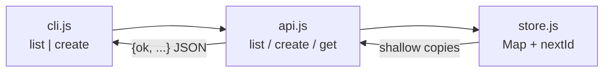

# How grounding: ticket-desk store / API / CLI

Traced mental model for soft-delete design. Source: how explorers (store, API, CLI) + explainer synthesis over `parity/evidence/architect/fixture-app`. No product decisions yet.

## Overview

ticket-desk is a three-layer, in-process stack: an in-memory **store** owns records and ids; an **API** facade wraps store results in `{ok, ...}` envelopes; a **CLI** parses argv and prints those envelopes as JSON. There is no HTTP server, no disk, and no delete/update path today. Soft-delete would extend each layer at known seams; several product choices (hide vs tombstone on get, list filtering API, restore) are still open.

## Key Concepts

- **Ownership split**
  - `store.js`: `Map` persistence, `nextId` allocation, title validation on create, shallow-copy returns, `_resetForTests`.
  - `api.js`: response envelopes (`ok` / `error` strings), optional-chaining of request bodies, not-found wording for get.
  - `cli.js`: argv → command dispatch → `JSON.stringify` of API results; usage on stderr + exit 1 for unknown commands.
- **Ticket shape** (store truth): `{ id, title, status, createdAt }` — `id` is `String(nextId++)`, `status` defaults to `'open'`, `createdAt` is `Date.now()`. No deleted/tombstone fields.
- **Error styles are asymmetric**: create throws in the store (API catches → `{ok:false,error}`); get returns `null` (API maps to `'not found'`); list never fails.
- **Lifetime**: module-level singleton for the life of one Node process. Each CLI invocation loads a fresh module graph — nothing persists across processes.

## How It Works

### List path

1. CLI: `cmd === 'list'` → `list()` from `api.js`.
2. `api.list` → `{ ok: true, tickets: listTickets() }`.
3. `listTickets` returns `[...tickets.values()].map(t => ({...t}))` — unfiltered, Map insertion order.
4. CLI prints JSON to stdout (exit 0).

### Create path

1. CLI: `cmd === 'create'` → `create({ title: rest.join(' ') })` (status not passed from CLI).
2. `api.create` try/catch around `createTicket({ title: body?.title, status: body?.status })`.
3. Store rejects falsy / non-string `title` with `throw new Error('title required')`; whitespace-only titles pass.
4. On success: store inserts into `tickets` Map under string id, returns a shallow copy; API returns `{ ok: true, ticket }`.
5. On failure: API returns `{ ok: false, error: String(...) }`. CLI still prints that JSON to stdout and exits 0.

### Get path (API-only today)

1. `api.get(id)` → `getTicket(id)`.
2. Missing → `{ ok: false, error: 'not found' }`; hit → `{ ok: true, ticket }` (store copy).
3. CLI does **not** import or expose `get`. README documents list/create only; `package.json` has no `bin`.

### Soft-delete plug-in map (extension points only — no design)

| Layer | Concrete seam |
|--------|----------------|
| **Store** | New mutation (e.g. soft-delete by id); tombstone field(s) on the ticket object kept in the Map; `listTickets` filtering (or a parallel listAll); `getTicket` policy for deleted rows; **do not** free/reuse ids (`nextId` only increments). |
| **API** | New export matching the `{ok,...}` envelope; decide whether `list` / `get` filter deleted rows or expose policy to callers; wire any restore the same way. |
| **CLI** | New `cmd` branch; import the new API fn; extend usage string; parse id from `rest[0]`; inherit current stdout-JSON / exit-0-on-API-error policy unless product changes it. |

**Open product questions (not decided in code):** get returns tombstone vs hide-as-not-found; list options vs always filter; `deletedAt` vs boolean; soft-delete idempotency; whether restore is in scope.

## Where Things Live

| Path | Role |
|------|------|
| `src/store.js` | Persistence + ids: `createTicket`, `listTickets`, `getTicket`, `_resetForTests` |
| `src/api.js` | Facade: `list`, `create`, `get` over store |
| `src/cli.js` | Entry: `list` \| `create <title...>` only |
| `package.json` | `"type": "module"`, private; no bin |
| `README.md` | Names store / api list-create / cli; omits `api.get` |

## Gotchas

- **String ids**: Map keys are strings (`"1"`). Passing a number to `getTicket` misses.
- **Status is unconstrained**: store default `'open'` only; no enum validation in store or API.
- **Validation ownership vs comment**: `api.js` header claims “request validation”; create title checks live in the store; API mostly shapes envelopes and optional-chains `body`.
- **CLI create title**: `rest.join(' ')` — empty rest yields `""`, which fails store validation and comes back as `{ok:false,...}` on stdout, not usage/exit 1.
- **API failures ≠ CLI failures**: unknown command → stderr + exit 1; create/list API errors → stdout JSON, exit 0.
- **No update/delete** today; list has no filter hooks; get is unwired from CLI and under-documented in README.
- **Copies vs identity**: callers get shallow copies; the Map holds the originals — mutating a returned object does not update the Map (and there is no update API anyway).

## Files traced

- `src/store.js`, `src/api.js`, `src/cli.js`, `package.json`, `README.md` under fixture-app.
