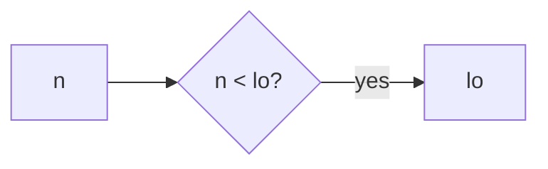
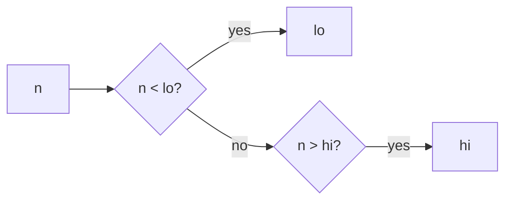
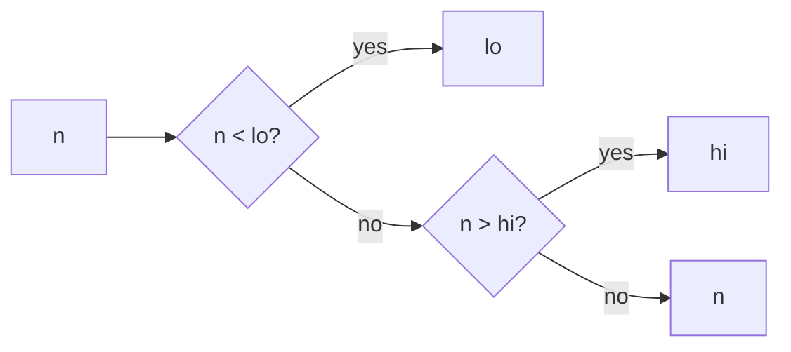

`clamp` is a small helper that keeps a number inside a closed range `[lo, hi]`. In this fixture it lives in `src/clamp.js` as the only real code.

You pass three values: the candidate `n`, the floor `lo`, and the ceiling `hi`. If `n` is below `lo`, you get `lo`. If it is above `hi`, you get `hi`. Otherwise you get `n` unchanged. No side effects. No type checks. No check that `lo <= hi`.

The bound checks live in the helper so call sites stay thin. The file comment and README both say that directly: callers use this once instead of repeating min/max at every site. Confidence on that claimed intent is high because those texts state it outright. Confidence that this came from an organic refactor of duplicated call sites is low. The fixture is untracked, has no git or PR trail, and has no callers in this tree. It is framed as held-out `/teach` grounding material. Treat the documented design reason as authoritative. Treat deeper product history as unknown.

Two things to watch: if someone passes `lo > hi`, the early returns get weird, and `NaN` falls through because `NaN` comparisons are false in JS.

Say if you want to walk a concrete call with numbers, or dig into the empty git trail further.
