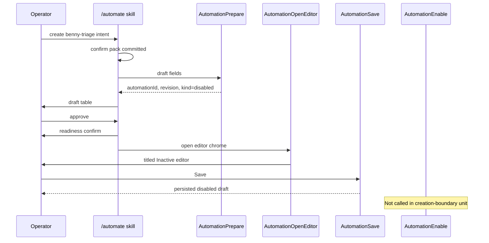

# Pi `/automate` editor handoff design

**status.** Design only. No product spike. Ledgers untouched. Requirement stays unverified.

throughput checkpoint: n/a, read-only investigation

## Overview

Cursor finishes first-time Benny automations only through the built-in `/automate` skill’s reviewed Automations editor handoff. The automation stays Inactive until thread-safety. Pi has no `/automate` skill and no Automations editor in PTY (`f4c7eec5`, probe `automationsEditorUiAvailableInPiPty=false`). Pi already has a reviewed disabled-draft pattern for **webhook** routines (`RoutinePrepare` → `RoutineEnable` + `ui.confirm`). That pattern is the right lifecycle shape and the wrong trigger domain for Benny Slack automations.

This design proposes a Pi-native `AutomationDraft` store and `/automate` skill that mirror Cursor’s creation-boundary finish path without calling Cursor backends.

## Recommendation

**Ship Option B. local automation drafts + TUI editor handoff.**

Do not claim `PSTACK-SETUP-BENNY-CREATION-BOUNDARY-001` verified from this unit. Freeze-prep Option A (keep-unverified) still stands until a paired Pi journey saves a disabled `benny-triage` draft through this handoff.

## Options

| Option | Shape | Verdict |
| --- | --- | --- |
| A Reuse webhook `Routine*` for Benny | Force Slack intent into `RoutineSchema` webhook fields | Reject. Wrong trigger. `RoutineEnable` starts a local receiver. Creation-boundary forbids enable before thread-safety and needs Slack top-level semantics |
| B New `AutomationDraft` + `/automate` + TUI editor | Parallel store under `pstack-automations`, Slack trigger variant, editor via `ctx.ui`, save stays `disabled` | **Accept.** Matches creation-boundary oracle and Pi-native-first rules |
| C Confirm-only without editor chrome | Draft + `ui.confirm` only | Reject for pair. Probe and journeys expect an Automations **editor** surface (`Add Trigger` / titled draft / Inactive), not enable-confirm alone |

## Key concepts

**Creation boundary.** Finish only via built-in automate → reviewed editor handoff. No backend create. No draft-field URL. No deep link. No enable before thread-safety after editor save.

**AutomationDraft.** Immutable revisioned definition. Always `kind=disabled` on prepare and save. Distinct from webhook `RoutineDefinition`.

**Editor handoff.** Operator-visible Pi UI that shows the named draft (title = automation name), trigger, instructions, tools, and Inactive/disabled state, then persists on Save without starting ingress.

**Owner hash.** Same isolation idea as routines. `sha256(cwd + sessionId)` under `getAgentDir()`.

## Data model

See `data-model.json`.

Canonical fields.

- `name`, `description`, `instructions`, optional `operationalPath`
- `trigger` discriminated union (`slack.top_level` | `webhook`)
- `tools` capability labels
- `kind` always `disabled` until a later enable unit
- `revision` sha256 of canonical body

Persistence path (proposed).

```text
{getAgentDir()}/pstack-automations/{ownerHash}/{automationId}/
  definition.json      # revisioned draft
  status.json          # absent ⇒ disabled
  thread-safety.json   # written only after seven checks (later unit)
```

Mode `0700` directories. Durable write pattern copied from `routine-client.mjs` (`durableRecord`).

## How it works



Enable path (out of creation scope). `AutomationEnable` is `model-only`, requires `ctx.hasUI`, shows `ui.confirm` with exact revision, and refuses unless `thread-safety.json` matches the revision.

## Cursor → Pi step map

See `step-map.md`.

## Non-goals

- No Cursor Automations HTTP/backend finish
- No inventing Slack posts or live channel discovery when MCP is absent
- No deep-link or draft-field URL finish
- No marking creation-boundary verified
- No ledger edits from design or first scaffold unit
- No conflating `automate-me` with `/automate`
- No migrating `pstack-routines` into this store in the first unit (webhook continue on routines until an explicit migrate)

## Gap list

1. ~~`skills/automate/SKILL.md` missing~~ → `host/skills/automate/SKILL.md` shipped
2. ~~`AutomationDraft` types + prepare/inspect/save/open-editor tools missing~~ → landed in `automations.ts` / `automation-client.mjs`
3. ~~TUI editor chrome missing~~ → `automationsEditorUiAvailableInPiPty=true` (chrome `pi-automations-editor-v1`)
4. Slack ingress runtime missing (not required to pay creation-boundary save-disabled half)
5. ~~Thread-safety receipt + Enable gate~~ → `AutomationRecordThreadSafety` + `AutomationEnable` (receipt + `ui.confirm` → local `status.json` kind=enabled). Live Slack seven-checks + Slack ingress still unpaid (gap 4).
6. ~~setup-benny Pi adapter text~~ → `host/adapters/benny/SKILL.md` routes first-time Slack Benny through host `/automate` + `AutomationPrepare`/`AutomationOpenEditor`; refuses webhook `Routine*` finish. Probe check `piSetupBennyAdapterUsesAutomatePath=true`.

## Spike decision

**No spike in this unit.** A cheap spike would only stub types without editor chrome. Editor chrome is the unpaid Pi half. Prefer one implementation unit that lands skill + disabled draft persist + minimal editor UI with tests green.

## Next unit

Copy-paste brief in the report and in `next-unit-brief.md`.
